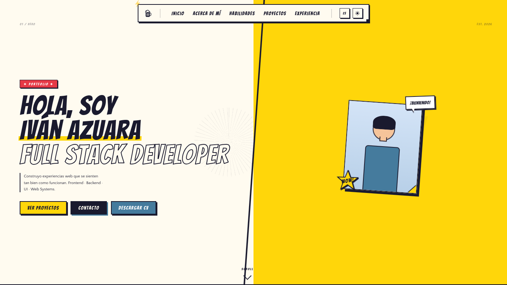
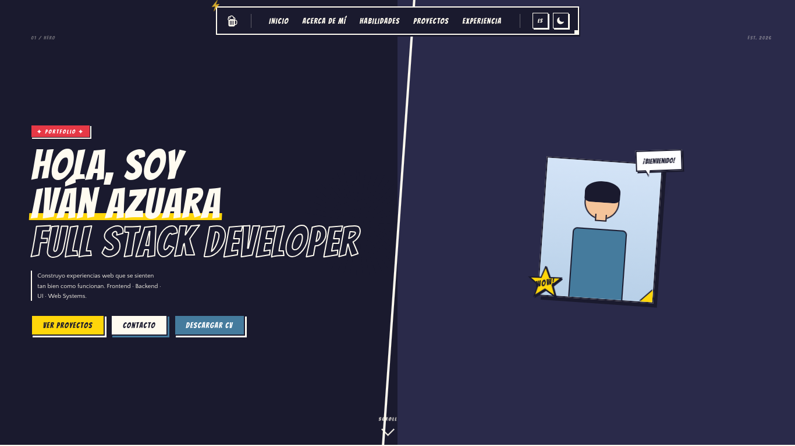

# 🎨 Portfolio — Mario Iván Azuara Del Angel

> Portfolio personal con estética de cómic / manga. Construido con Astro, Tailwind CSS v4 y un sistema de internacionalización (i18n) cliente.

[](https://github.com/IvAzuara/Portfolio/actions/workflows/astro.yml)
[](https://ivazuara.github.io/Portfolio)

---

## 📸 Preview

> _Tema Claro del portafiolio (Hero)._
> 

> _Tema Oscuro del portafiolio (Hero)._
> 

---

## ✨ Características

- 🎨 **Diseño estilo cómic** — paneles, sombras offset, tipografía Bangers, halftone y speed lines
- 🌗 **Dark / Light mode** — toggle en la navbar, persistido en `localStorage`
- 🌐 **i18n cliente** — cambio de idioma (ES / EN) instantáneo sin recarga de página
- 📬 **Formulario de contacto** — integrado con EmailJS, sin backend
- 📄 **Descarga de CV** — PDF accesible directo desde el hero
- ⚡ **Deploy automático** — GitHub Actions construye y despliega en cada push a `master`

---

## 🛠️ Tech Stack

| Categoría       | Tecnología                          |
|-----------------|-------------------------------------|
| Framework       | [Astro](https://astro.build) v5     |
| Estilos         | [Tailwind CSS](https://tailwindcss.com) v4 |
| Tipografía      | Bangers · Quattrocento (Google Fonts) |
| Iconos          | Ionicons · Devicons                 |
| Formulario      | [EmailJS](https://emailjs.com)      |
| Deploy          | GitHub Pages + GitHub Actions       |

---

## 🚀 Correrlo localmente

### Requisitos

- Node.js `>= 18`
- npm `>= 9`

### Instalación

```bash
# 1. Clona el repo
git clone https://github.com/IvAzuara/Portfolio.git
cd Portfolio

# 2. Instala dependencias
npm install

# 3. Crea el archivo de variables de entorno
cp .env.example .env
```

Edita `.env` con tus credenciales de EmailJS:

```env
PUBLIC_EMAILJS_PUBLIC_KEY=tu_public_key
PUBLIC_EMAILJS_SERVICE_ID=tu_service_id
PUBLIC_EMAILJS_TEMPLATE_ID=tu_template_id
```

```bash
# 4. Inicia el servidor de desarrollo
npm run dev
```

Abre [http://localhost:4321](http://localhost:4321) en tu navegador.

### Scripts disponibles

| Comando           | Descripción                          |
|-------------------|--------------------------------------|
| `npm run dev`     | Servidor de desarrollo con hot reload |
| `npm run build`   | Build de producción en `/dist`        |
| `npm run preview` | Vista previa del build de producción  |

---

## 📁 Estructura del proyecto

```
Portfolio/
├── .github/
│   └── workflows/
│       └── astro.yml           # GitHub Actions — build y deploy automático
│
├── public/
│   └── CV-IvanAzuara.pdf       # CV descargable
│
├── src/
│   ├── components/
│   │   ├── About.astro         # Sobre mí
│   │   ├── Contact.astro       # Formulario de contacto (EmailJS)
│   │   ├── Experience.astro    # Timeline de experiencia
│   │   ├── Hero.astro          # Sección principal con CTAs
│   │   ├── Projects.astro      # Proyectos con flip cards
│   │   └── Skills.astro        # Habilidades técnicas
│   │
│   ├── i18n/
│   │   ├── index.ts             # Helper getLang() y translate()
│   │   ├── es.json             # Traducciones en español
│   │   └── en.json             # Traducciones en inglés
│   │
│   ├── layouts/
│   │   ├── MainIndex.astro        # Layout base con head, fuentes e ionicons
│   │   └── Navigation/
│   │       └── Navbar.astro        # Navegación + toggle dark mode + toggle idioma
│   │
│   ├── pages/
│   │   └── index.astro         # Página principal — importa todos los componentes
│   │
│   └── styles/
│       ├── styles.css          # Estilos globales
│       └── tailwind.css        # Configuración Tailwind + estilos globales
│
├── astro.config.mjs            # Configuración de Astro (base, site, vite)
└── package.json
```

---

## 🔐 Variables de entorno

Las credenciales de EmailJS **nunca se suben al repo**. Para producción se configuran como secrets en GitHub:

`Settings → Secrets and variables → Actions`

| Secret                      | Descripción              |
|-----------------------------|--------------------------|
| `EMAILJS_PUBLIC_KEY`        | Clave pública de EmailJS |
| `EMAILJS_SERVICE_ID`        | ID del servicio de email |
| `EMAILJS_TEMPLATE_ID`       | ID de la plantilla       |

---

## 📄 Licencia

Este proyecto es de uso personal. Si quieres usar el diseño como base para tu propio portfolio, ¡adelante! Un crédito siempre es bienvenido. 🙌

---

<p align="center">
  Hecho con ☕ y mucho CSS · <a href="https://ivazuara.github.io/Portfolio">ivazuara.github.io/Portfolio</a>
</p>